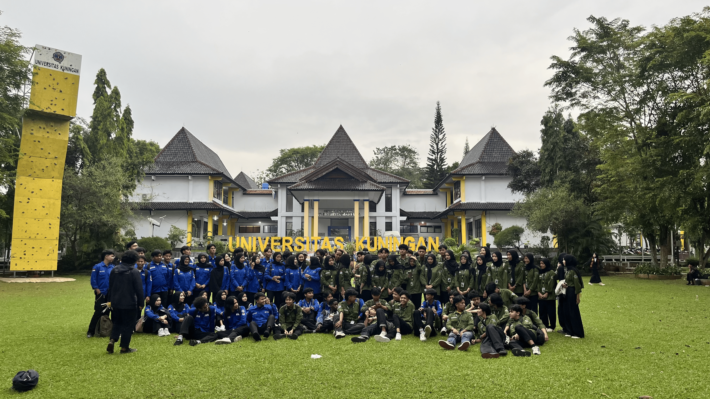

HIMASANTIKA — Cinematic Website

Website profil HIMASANTIKA (Himpunan Mahasiswa Teknik Informatika) dengan konsep cinematic, modern, dan interactive storytelling.

Project ini menggunakan kombinasi HTML, CSS, JavaScript, GSAP, ScrollTrigger, dan <model-viewer> untuk menghasilkan hero section dengan model 3D, photo cards, stage transition, progress indicator, serta animasi berbasis scroll.

Preview Website

  
  &nbsp;
  

  
  &nbsp;
  

Catatan: gambar di atas menggunakan asset yang memang sudah ada di project sebagai preview visual. Tampilan final website akan menggabungkan asset tersebut dengan layout dan animasi cinematic.

🧩 Struktur Project

HIMASANTIKA/
│
├── index.html
├── style.css
├── script.js
│
└── img/
    ├── logo.png
    ├── logo.glb
    ├── 1.png
    ├── 2.png
    ├── 3.jpg
    ├── 4.jpg
    ├── 5.jpg
    ├── 6.jpg
    └── ...

🛠️ Teknologi

Teknologi

Fungsi

HTML5

Struktur halaman

CSS3

Visual system, layout, responsive styling

JavaScript

Logic dan interaction

GSAP

Animation engine

ScrollTrigger

Scroll-based animation

<model-viewer>

Menampilkan model .glb

Google Fonts

Inter + Space Grotesk

🌌 Hero Experience

Hero dirancang dengan beberapa layer visual:

Background
 ├── Gradient
 ├── Grid
 ├── Blue Glow
 ├── Gold Glow
 ├── Purple Glow
 ├── Particles
 ├── Vignette
 └── Grain
        ↓
Photo Cards
        ↓
3D HIMASANTIKA Emblem
        ↓
Stage Content
        ↓
Scroll Progress

Model 3D utama menggunakan:

<model-viewer src="./img/logo.glb">

Model tetap menggunakan satu asset 3D yang sama sepanjang cinematic sequence.

📖 Struktur Konten

01 — Beranda

Hero introduction dengan:

HIMASANTIKA

deskripsi organisasi

CTA

photo cards

3D emblem

scroll cue

02 — Kegiatan

Menampilkan aktivitas dan program HIMASANTIKA.

03 — Cerita Kami

Menampilkan perjalanan organisasi melalui beberapa panel storytelling.

04 — Divisi

Menampilkan struktur/departemen HIMASANTIKA dalam bentuk interactive cards.

05 — Tentang Kami

Bagian informasi organisasi dan identitas HIMASANTIKA.

🎨 Visual Direction

Project menggunakan visual direction:

Clean

Modern

Academic

Technology-oriented

Cinematic

Premium

Light interface

Blue + gold accent

Glassmorphism ringan

Soft shadow

Depth melalui motion

Palet utama:

Background   #F4F7FB
Blue         #0B4F9C
Dark Blue    #06366E
Gold         #F5A623
Text         #10233F
Soft Text    #64748B

⚡ Menjalankan Project

Karena project menggunakan asset lokal dan model .glb, paling aman menjalankannya melalui local development server, bukan sekadar membuka index.html dengan file://.

Contoh:

# Python
python -m http.server 8000

Kemudian buka:

http://localhost:8000

Pastikan struktur asset tetap sama, terutama:

img/logo.glb
img/logo.png

🎞️ Animation Philosophy

Animasi project ini tidak ditujukan untuk sekadar membuat halaman terlihat ramai.

Prinsip utamanya:

Timing + Easing + Hierarchy + Depth + Restraint

Elemen utama mendapatkan perhatian terlebih dahulu, kemudian elemen pendukung mengikuti melalui stagger dan transition.

Target akhirnya adalah membuat website terasa seperti:

Website
   ↓
Interactive Presentation
   ↓
Cinematic Storytelling

🔧 Animation Upgrade

Jika ingin mengembangkan animasi lebih lanjut, fokus utama sebaiknya tetap pada:

Hero entrance

Text reveal

Photo-card entrance

3D model entrance

Stage transition

Micro-interaction

Ambient background motion

Performance optimization

Hindari menambahkan efek hanya agar terlihat lebih ramai.

Animasi yang baik harus meningkatkan hierarchy dan pengalaman pengguna, bukan mengganggunya.

📱 Responsive

Project memiliki breakpoint desktop/mobile dan sistem positioning berbeda untuk model 3D.

Target:

Desktop → cinematic experience penuh

Tablet → motion dikurangi bila diperlukan

Mobile → readability dan performance diprioritaskan

♿ Reduced Motion

Animasi sebaiknya tetap menghormati preferensi pengguna terhadap reduced motion.

Konsepnya:

@media (prefers-reduced-motion: reduce) {
  /* reduce non-essential motion */
}

Konten utama tetap harus dapat diakses walaupun animasi dikurangi.

📂 File Utama

index.html

Berisi struktur halaman, hero stages, photo systems, content sections, navigation, dan model viewer.

style.css

Berisi visual system, layout, responsive styling, photo cards, hero layers, typography, dan styling komponen.

script.js

Berisi logic interaksi, GSAP timeline, ScrollTrigger, stage transition, model movement, photo animation, navigation, loader, dan progress system.

🚀 Development Goal

Project ini dapat dikembangkan menjadi website organisasi mahasiswa dengan pengalaman visual yang lebih kuat melalui:

cinematic page transitions

advanced text masking

refined 3D interaction

scroll choreography

magnetic interaction

ambient motion

optimized mobile animation

accessibility improvements

Namun prinsip utama tetap:

Pertahankan identitas HIMASANTIKA. Tingkatkan experience-nya.

📜 Ketentuan Lomba & Pernyataan Karya

Project ini juga memperhatikan ketentuan yang tercantum pada formulir pengumpulan lomba.

✅ Kelengkapan README.md

README.md wajib memuat:

Penjelasan konsep project.

Teknologi yang digunakan.

Cara instalasi / menjalankan website secara lokal.

Dokumentasi tersebut tersedia di README ini pada bagian:

Konsep Animasi

Teknologi

Menjalankan Project

Struktur Project

⚠️ Pernyataan Orisinalitas Karya

Dengan mengikuti ketentuan lomba, peserta menyatakan:

Saya / Kami menjamin bahwa karya yang dikumpulkan ini orisinal, dibuat khusus untuk lomba ini, bukan merupakan template instan, dan belum pernah diikutsertakan dalam kompetisi lain. Saya / Kami bersedia didiskualifikasi jika terbukti melakukan kecurangan.

Pernyataan tersebut merupakan bagian dari ketentuan pengumpulan dan menjadi tanggung jawab peserta untuk memastikan kebenarannya.

Penting: Jangan mencantumkan klaim orisinalitas yang tidak benar. Pastikan seluruh asset, kode, template, library, dan materi yang digunakan sesuai dengan aturan lomba yang berlaku.

👨‍💻 HIMASANTIKA

Himpunan Mahasiswa Teknik Informatika

Kolaborasi, Inovasi, Berdampak.
